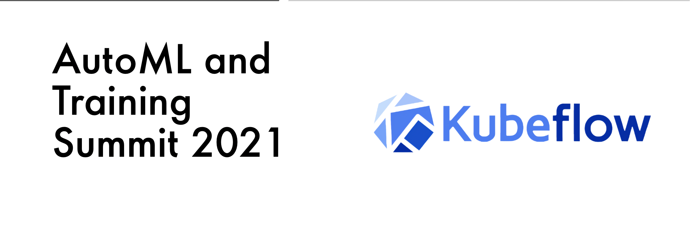
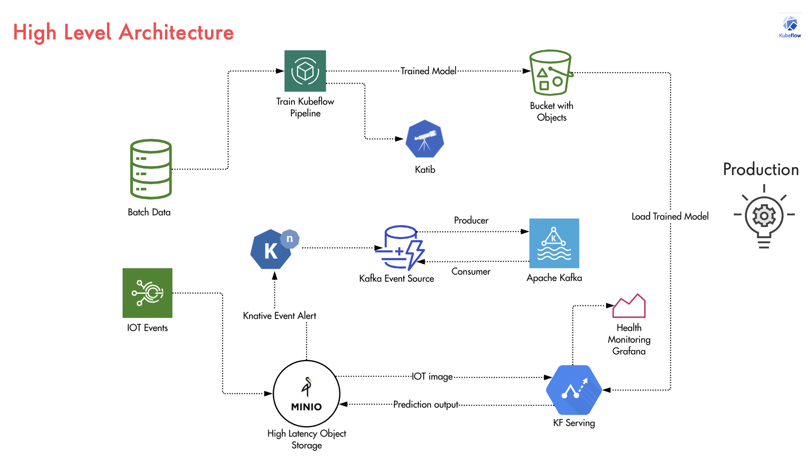

# Kubeflow AutoML and Training Summit 2021

Kubeflow Training and AutoML 2021

##

## ⚡ Technologies

<code>Kubeflow</code>

## Building Real time Image classification with Kubeflow Orchestrator 

